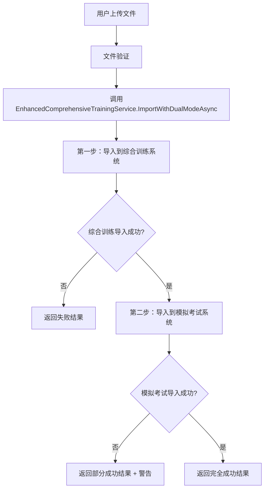
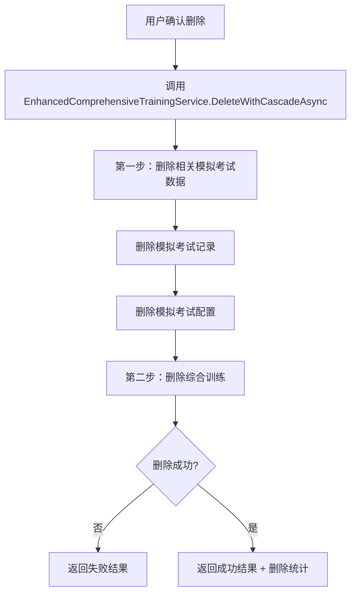

# 双重模式综合训练系统实现说明

## 概述

本文档描述了对综合训练管理系统的增强，实现了双重操作模式：
1. **扩展上传功能**：将上传的综合训练数据同时导入到模拟考试系统中
2. **扩展删除功能**：删除综合训练时，同时删除相关的模拟考试数据

## 实现架构

### 1. 核心服务层

#### **EnhancedComprehensiveTrainingService**
新增的增强服务，提供双重操作模式：

```csharp
// 位置：ExaminaWebApplication/Services/ImportedComprehensiveTraining/EnhancedComprehensiveTrainingService.cs

public class EnhancedComprehensiveTrainingService
{
    // 双重模式导入：综合训练 + 模拟考试
    public async Task<EnhancedImportResult> ImportWithDualModeAsync(Stream fileStream, string fileName, int importedBy)
    
    // 级联删除：综合训练 + 相关模拟考试数据
    public async Task<EnhancedDeleteResult> DeleteWithCascadeAsync(int comprehensiveTrainingId, int userId)
}
```

**核心功能**：
- **ImportWithDualModeAsync**：先导入到综合训练系统，再导入到模拟考试系统
- **DeleteWithCascadeAsync**：先删除相关模拟考试数据，再删除综合训练
- **ImportToMockExamSystemAsync**：将综合训练数据导入到模拟考试系统
- **DeleteRelatedMockExamDataAsync**：删除相关的模拟考试记录和配置

### 2. 控制器层修改

#### **ComprehensiveTrainingManagementController**
修改了导入和删除方法以使用增强服务：

```csharp
// 修改前：单一模式导入
ComprehensiveTrainingImportResult result = await _comprehensiveTrainingImportService.ImportComprehensiveTrainingAsync(
    fileStream, comprehensiveTrainingFile.FileName, userId);

// 修改后：双重模式导入
EnhancedImportResult result = await _enhancedComprehensiveTrainingService.ImportWithDualModeAsync(
    fileStream, comprehensiveTrainingFile.FileName, userId);
```

```csharp
// 修改前：单一删除
bool success = await _comprehensiveTrainingImportService.DeleteImportedComprehensiveTrainingAsync(id, userId);

// 修改后：级联删除
EnhancedDeleteResult result = await _enhancedComprehensiveTrainingService.DeleteWithCascadeAsync(id, userId);
```

### 3. 视图层增强

#### **用户界面改进**
1. **视觉提示**：在综合训练详情页面添加"可用于模拟考试"标识
2. **删除确认**：增强删除确认对话框，明确说明删除影响范围
3. **成功反馈**：导入成功时显示双重导入状态

## 详细实现

### 1. 双重模式导入流程



**关键步骤**：
1. **文件验证**：验证文件类型、大小等
2. **综合训练导入**：使用现有的ComprehensiveTrainingImportService
3. **模拟考试导入**：将题目数据标记为可用于模拟考试
4. **结果反馈**：提供详细的导入状态信息

### 2. 级联删除流程



**关键步骤**：
1. **查找相关数据**：查找基于该综合训练创建的模拟考试
2. **删除模拟考试记录**：删除MockExam表中的相关记录
3. **删除模拟考试配置**：删除MockExamConfiguration表中的相关配置
4. **删除综合训练**：使用现有的删除方法
5. **统计反馈**：返回删除的记录数量

### 3. 数据关联机制

#### **综合训练与模拟考试的关联**
```csharp
// 模拟考试记录中包含综合训练ID信息
public class MockExam
{
    public string ExtractedQuestions { get; set; } // JSON格式，包含comprehensiveTrainingId
}

// 模拟考试配置中包含抽取规则
public class MockExamConfiguration  
{
    public string ExtractionRules { get; set; } // JSON格式，包含comprehensiveTrainingId
}
```

#### **关联查询逻辑**
```csharp
// 查找相关的模拟考试记录
List<MockExam> relatedMockExams = await _context.MockExams
    .Where(me => me.StudentId == userId && 
                me.ExtractedQuestions.Contains($"\"comprehensiveTrainingId\":{comprehensiveTrainingId}"))
    .ToListAsync();

// 查找相关的模拟考试配置
List<MockExamConfiguration> relatedConfigs = await _context.MockExamConfigurations
    .Where(mec => mec.CreatedBy == userId && 
                 mec.ExtractionRules.Contains($"comprehensiveTrainingId:{comprehensiveTrainingId}"))
    .ToListAsync();
```

## 用户体验改进

### 1. 导入过程反馈

**成功导入**：
```
综合训练 'C#基础编程训练' 导入成功！共导入 3 个科目，5 个模块，25 道题目，题目已同时导入到模拟考试系统，可用于模拟考试
```

**部分成功**：
```
综合训练 'C#基础编程训练' 导入成功！共导入 3 个科目，5 个模块，25 道题目。注意：综合训练导入成功，但模拟考试系统导入失败，题目可能无法用于模拟考试
```

### 2. 删除过程反馈

**成功删除**：
```
综合训练删除成功，同时删除了 3 个相关的模拟考试记录
```

**删除确认对话框**：
```
删除影响范围
此操作将删除以下数据：
• 综合训练的所有科目、模块、题目和操作点数据
• 相关的模拟考试记录和配置  
• 基于此综合训练创建的所有模拟考试
此操作不可撤销，请谨慎操作！
```

### 3. 视觉标识

**综合训练详情页面**：
- 添加"可用于模拟考试"绿色标识
- 明确显示该综合训练可以用于创建模拟考试

## 技术特性

### 1. 事务安全性

```csharp
// 使用数据库事务确保数据一致性
using var transaction = await _context.Database.BeginTransactionAsync();
try
{
    // 删除相关模拟考试数据
    await DeleteRelatedMockExamDataAsync(comprehensiveTrainingId, userId);
    
    // 删除综合训练
    await _comprehensiveTrainingImportService.DeleteImportedComprehensiveTrainingAsync(comprehensiveTrainingId, userId);
    
    await transaction.CommitAsync();
}
catch (Exception ex)
{
    await transaction.RollbackAsync();
    throw;
}
```

### 2. 错误处理

```csharp
// 分层错误处理
try
{
    // 双重模式导入
    EnhancedImportResult result = await ImportWithDualModeAsync(fileStream, fileName, importedBy);
    
    if (!result.IsSuccess)
    {
        // 记录详细错误信息
        _logger.LogError("双重模式导入失败：{ErrorMessage}", result.ErrorMessage);
    }
}
catch (Exception ex)
{
    // 异常捕获和日志记录
    _logger.LogError(ex, "双重模式导入过程中发生异常");
    return new EnhancedImportResult { IsSuccess = false, ErrorMessage = ex.Message };
}
```

### 3. 性能优化

```csharp
// 使用分割查询提升性能
.Include(ct => ct.Subjects)
    .ThenInclude(s => s.Questions)
        .ThenInclude(q => q.OperationPoints)
            .ThenInclude(op => op.Parameters)
.Include(ct => ct.Modules)
    .ThenInclude(m => m.Questions)
        .ThenInclude(q => q.OperationPoints)
            .ThenInclude(op => op.Parameters)
.AsSplitQuery() // 使用分割查询
```

## 配置和部署

### 1. 服务注册

```csharp
// Program.cs
// 注册综合训练导入相关服务
builder.Services.AddScoped<ComprehensiveTrainingImportService>();
builder.Services.AddScoped<EnhancedComprehensiveTrainingService>(); // 新增
```

### 2. 依赖注入

```csharp
// ComprehensiveTrainingManagementController
public ComprehensiveTrainingManagementController(
    ComprehensiveTrainingImportService comprehensiveTrainingImportService,
    SpecializedTrainingImportService specializedTrainingImportService,
    EnhancedComprehensiveTrainingService enhancedComprehensiveTrainingService, // 新增
    ILogger<ComprehensiveTrainingManagementController> logger)
```

## 测试建议

### 1. 功能测试

**导入测试**：
- 测试正常的双重模式导入
- 测试综合训练导入成功但模拟考试导入失败的情况
- 测试文件格式验证和错误处理

**删除测试**：
- 测试级联删除功能
- 测试删除统计的准确性
- 测试权限验证

### 2. 集成测试

**端到端测试**：
- 导入综合训练 → 创建模拟考试 → 删除综合训练
- 验证数据一致性和完整性

### 3. 性能测试

**大数据量测试**：
- 测试大型综合训练文件的导入性能
- 测试包含大量题目的综合训练删除性能

## 总结

通过实现双重模式操作，综合训练管理系统现在具备了：

1. ✅ **扩展的上传功能**：自动将综合训练数据导入到模拟考试系统
2. ✅ **扩展的删除功能**：级联删除相关的模拟考试数据
3. ✅ **数据一致性保证**：确保综合训练和模拟考试数据的关联性
4. ✅ **用户体验优化**：提供清晰的操作反馈和影响范围说明
5. ✅ **错误处理机制**：完善的异常处理和日志记录
6. ✅ **性能优化**：使用分割查询和事务管理

这些改进确保了综合训练数据既可以作为综合训练使用，也可以作为模拟考试的题库使用，同时保持了数据的完整性和一致性。
